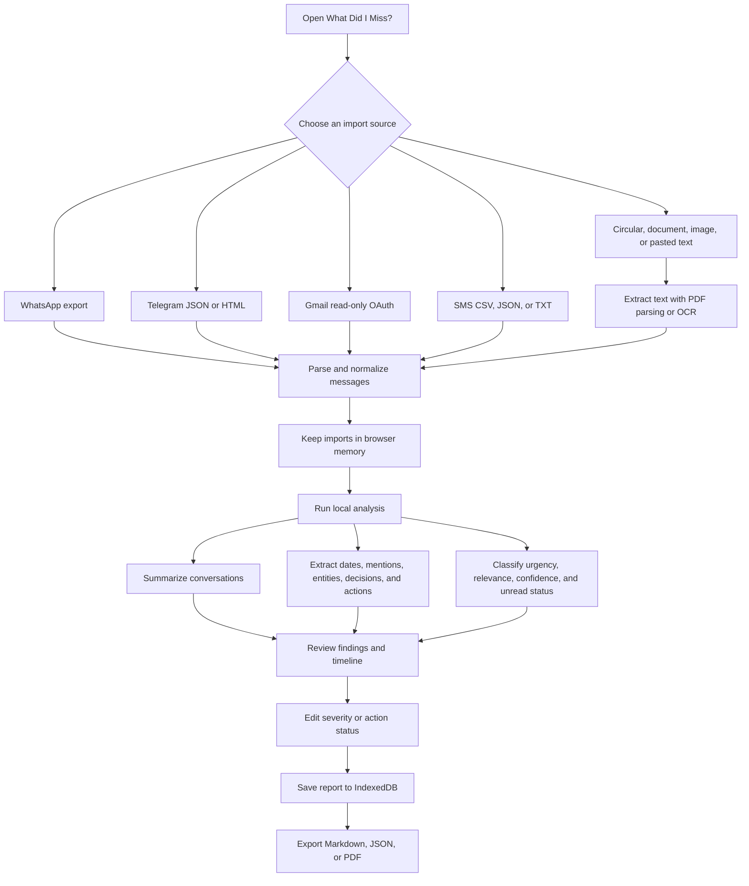

# What Did I Miss?

> A local-first AI micro-app for turning unread conversations, notices, emails, and documents into a clear, prioritized list of what matters.

## The problem

Important information is often buried in long group chats, email threads, SMS exports, circulars, screenshots, and documents. **What Did I Miss?** helps a user answer four questions quickly:

1. What is the short summary?
2. Which messages are important?
3. What decisions and actions were made?
4. Which mentions, deadlines, or tasks might I have missed?

The application is designed around the hackathon challenge, **“The Unread Problem — What Did I Miss?”** It uses transparent, deterministic local heuristics rather than a remote generative AI service. Imported content and generated reports stay in the browser.

## Demo workflow



## End-to-end workflow

1. **Select a source** from the Import Sources page.
2. **Add files or paste text.** Duplicate files are detected using a local filename/size/modified-time fingerprint.
3. **Parse locally.** Source-specific parsers convert supported exports into one normalized message model. PDFs are text-extracted where possible; scanned images and pages can use OCR.
4. **Review the import queue.** The app shows pending files, message counts, warnings, and OCR status before analysis.
5. **Analyze.** The deterministic analysis engine processes normalized messages without sending message content to a server.
6. **Inspect results.** The Analysis page presents an executive summary, prioritized findings, action items, decisions, unresolved questions, timeline dates, mentions, sources, confidence, and limitations.
7. **Correct or confirm.** Users can review low-confidence dates, adjust finding severity, and mark action items completed.
8. **Save or export.** Reports are saved locally in IndexedDB and can be downloaded as PDF, Markdown, or JSON.

## Feature coverage

### Challenge requirements

| Challenge requirement | How the app handles it |
| --- | --- |
| Summarize long and unread conversations | Imports preserve message timestamps and unread markers when available. The local summarizer produces an executive summary, conversation summaries, and source-level context. |
| Identify important messages | Every message is categorized and scored. Trivial S0 chatter is de-emphasized for larger imports while meaningful findings remain visible. |
| Identify decisions | Decision-language detection and summary extraction surface agreements, finalized plans, approvals, and changed arrangements. |
| Identify action items | Imperative/request language, commitments, assignments, and deadline-bearing messages become editable pending/completed action items. |
| Prioritize by urgency and relevance | Findings receive S0–S4 severity, a priority score, confidence, reasoning, and direct/indirect relevance. Date proximity and safety/financial/academic signals raise priority. |
| Highlight mentions | Entity extraction recognizes person mentions, names, email addresses, phone numbers, URLs, and other references so users can find messages directed at them. |
| Highlight deadlines | Date extraction identifies deadline, submission, registration, meeting, event, and reminder language and renders it in the timeline. Ambiguous dates are marked for review rather than silently treated as certain. |
| Highlight missed tasks | Unread markers, past dates, unanswered questions, pending actions, and explicit commitments are used to identify potentially missed information. |
| Local-first processing | Parsing, OCR, normalization, analysis, report editing, and persistence run in the browser. There is no application backend or remote AI inference endpoint. |

### Import sources

- **WhatsApp:** exported `.txt` chats and ZIP archives.
- **Telegram:** Desktop JSON and HTML exports.
- **Gmail:** optional Google Identity Services read-only connection using the Gmail `readonly` scope. Messages are fetched for analysis only; the app never modifies mail.
- **SMS:** CSV, JSON, and text backups.
- **Circulars and notices:** PDFs, images, CSV, JSON, and text.
- **Documents:** PDF, TXT, CSV, JSON, EML, and other text-readable files.
- **Images:** JPG, PNG, WebP, BMP, and GIF screenshots/photos processed with browser OCR.
- **Other / pasted text:** custom text and miscellaneous supported files.

## How it works internally

### Normalization

Each source is converted to `NormalizedMessage` objects containing:

- source type, filename, and stable source identifier;
- sender, recipient, subject, conversation name, and message index;
- original text and timestamp;
- unread, edited, deleted, media, attachment, and sensitive-content flags;
- OCR confidence and date-order hints where applicable.

This gives every parser the same downstream analysis behavior.

### Deterministic local intelligence

The analysis pipeline is intentionally explainable:

1. Extract dates and times.
2. Extract entities and mentions.
3. Categorize the message.
4. Classify severity and confidence.
5. Generate reasoning and a required-action suggestion.
6. Extract action items, decisions, and unresolved questions.
7. Build a timeline and source references.
8. Generate an executive summary and limitations.

The engine is not presented as a generative model. Its output is a transparent local interpretation that users can review and edit.

### Severity model

| Level | Meaning |
| --- | --- |
| S0 | Informational or routine context |
| S1 | Low-impact reminder or optional update |
| S2 | Task, response, or routine deadline needing attention |
| S3 | Urgent request, near-term deadline, missed commitment, or important schedule change |
| S4 | Explicitly time-critical or potentially serious information |

Each finding also includes confidence, reasoning, source location, extracted dates/entities, and a review flag for uncertain dates.

## Technology stack

| Layer | Technology |
| --- | --- |
| UI | React 19, TypeScript 6, React Router |
| Build and development | Vite 8, Tailwind CSS 4 |
| Motion and icons | Framer Motion, Lucide React |
| State | Zustand |
| Browser persistence | IndexedDB via `idb`; localStorage for theme preference |
| File formats | JSZip, PDF.js, CSV/JSON/text/EML parsers |
| OCR | Tesseract.js, executed in the browser |
| Exports | jsPDF, Markdown, JSON |
| Offline install | Vite PWA plugin and service worker |
| Testing | Vitest, Testing Library, jsdom |
| Quality | TypeScript strict mode and Oxlint |

## Storage and data lifecycle

### Stored locally

- Saved reports and their analysis output are stored in the browser's `wdim-db` IndexedDB database.
- Application settings are stored in the same local database.
- The selected theme is stored in localStorage.
- Imported messages remain in application memory while the user is working.

### Deliberately not stored

- Raw uploaded files are not written to IndexedDB.
- Gmail OAuth access tokens are kept in memory only.
- Tokens are removed defensively before report persistence.
- No raw message content is logged to the console.

Reports can be deleted individually or all at once from the Saved Reports page.

## Privacy and security

- **No application server:** the core workflow does not upload conversations or reports.
- **Local analysis:** parsing, heuristics, OCR, and report generation run on the device.
- **Read-only Gmail access:** Gmail integration requests only `https://www.googleapis.com/auth/gmail.readonly` and does not send, delete, label, or modify mail.
- **Token hygiene:** OAuth tokens are not persisted and storage sanitization removes token-like fields before saving.
- **Safe HTML handling:** Telegram HTML and HTML email content is converted to inert text with `DOMParser`; scripts, frames, embeds, templates, and styles are removed.
- **Sensitive-content protection:** OTP messages can be identified and redacted in previews/reports according to settings.
- **Explicit uncertainty:** ambiguous dates and low-confidence OCR are marked for review instead of being represented as facts.
- **No content telemetry:** the application does not send message text, summaries, or report contents to analytics or external AI services.
- **Browser boundary:** users should still use a trusted browser/device and understand that browser storage is local to the profile and can be cleared by the browser.

## Gmail configuration (optional)

Gmail is optional. To enable it:

1. Create a Google OAuth client ID for a browser application.
2. Add the local origin to the OAuth client's allowed JavaScript origins.
3. Start the app with `VITE_GOOGLE_CLIENT_ID` available, or enter the client ID in Settings.
4. Connect from the Gmail import page and grant read-only access.

Example `.env.local`:

```env
VITE_GOOGLE_CLIENT_ID=your-browser-client-id.apps.googleusercontent.com
```

Do not commit `.env.local` or credentials.

## Run locally

Requirements: Node.js 20+ and npm.

```bash
npm install
npm run dev
```

Open the local URL printed by Vite, normally `http://127.0.0.1:5173/`.

### Production build and preview

```bash
npm run build
npm run preview
```

### Tests

```bash
npm test
```

## Project structure

```text
src/
  components/       Reusable layout and UI primitives
  lib/
    analysis/       Local summarization, extraction, categorization, scoring
    parsers/        WhatsApp, Telegram, Gmail, SMS, PDF, document, and OCR parsers
    db.ts           IndexedDB persistence
    export.ts       PDF, Markdown, and JSON export
    gmail.ts        Read-only Gmail client
    sanitize.ts     Safe HTML-to-text conversion
    store.ts        Import, analysis, settings, theme, and toast state
  pages/            Dashboard, upload flows, analysis, reports, settings
  types/            Shared domain types and severity/category definitions
docs/
  CONTRACTS.md      Integration contracts and implementation invariants
```

## Current limitations

- Heuristics can misunderstand sarcasm, implicit context, or highly domain-specific language.
- OCR quality depends on image resolution, font, layout, and language support.
- Date formats that cannot be defended are flagged for confirmation.
- Gmail requires the user's own OAuth configuration and browser consent.
- The app is local-first, so clearing browser site data removes locally saved reports.

The app makes these limitations visible in report metadata so users can judge results rather than treating automated extraction as certainty.

## License

This project was created for the PULSE hackathon. Add the repository's chosen license before distributing it outside the hackathon.
